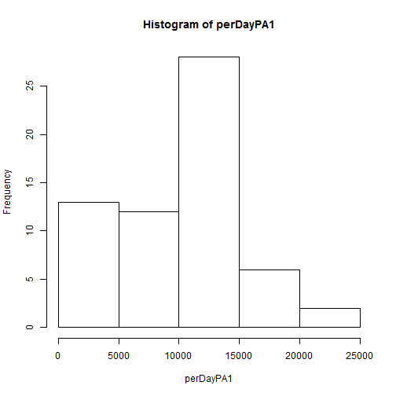
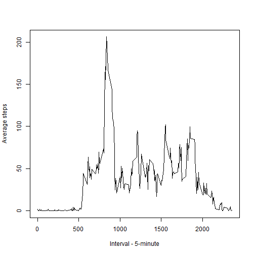
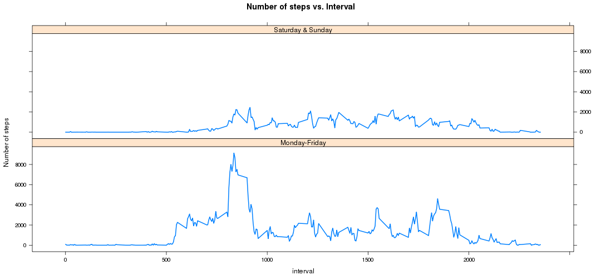

Reproducible Research: Peer Assessment 1
========================================================

## Down dload data one time

```r
# setwd('Coursera/repdata/')

# download.file('https://d396qusza40orc.cloudfront.net/repdata%2Fdata%2Factivity.zip','repdata-data-activity.zip','curl')

# unzip data unzip('repdata-data-activity.zip')
```

## Loading and preprocessing the data
1. Load the data (i.e. read.csv())

2. Process/transform the data (if necessary) into a format suitable for your analysis

```r
pa1 <- read.csv("./activity.csv", sep = ",", head = T, colClasses = c("integer", 
    "Date", "integer"))
head(pa1)
```

```
##   steps       date interval
## 1    NA 2012-10-01        0
## 2    NA 2012-10-01        5
## 3    NA 2012-10-01       10
## 4    NA 2012-10-01       15
## 5    NA 2012-10-01       20
## 6    NA 2012-10-01       25
```


## What is mean total number of steps taken per day?

* calculate steps after Splitting data by date. ignore NAs
* Plot histogamme.
* Calculate mean & medaine.


```r
perDayPA1 <- sapply(split(pa1$steps, pa1$date), sum, na.rm = T)

hist(perDayPA1)
```

 

```r

pa1mean <- mean(perDayPA1)
pa1median <- median(perDayPA1)
```

Mean of per day steps : **9354.2295** 
Mediane of daily steps per day : **10395.** 

## What is the average daily activity pattern?

```r
avgDailyAct <- sapply(split(pa1$steps, pa1$interval), mean, na.rm = T)
int <- unique(pa1$interval)
plot(x = int, y = avgDailyAct, type = "l", xlab = "Interval - 5-minute", ylab = "Average steps")
```

 

```r

intTot <- sapply(split(pa1$steps, pa1$interval), sum, na.rm = T)
i <- which.max(intTot)
intMax <- int[i]
```

## Imputing missing values


```r
nrow(na.omit(pa1))
```

```
## [1] 15264
```

```r
cleanpa1 <- pa1
for (i in 1:nrow(pa1)) {
    if (is.na(pa1$steps[i])) {
        cleanpa1$steps[i] <- avgDailyAct[(i%%288) + 1]
    }
}
```

newPerDayPA1 <- sapply(split(cleanpa1$steps,cleanpa1$date),sum,na.rm=T)
hist(newPerDayPA1)

newPa1mean <- mean(newPerDayPA1)
newPa1median <- median(newPerDayPA1)

Mean of per day steps : **1.0766 &times; 10<sup>4</sup>** 
Mediane of daily steps per day : **1.0766 &times; 10<sup>4</sup>.** 

## Are there differences in activity patterns between weekdays and weekends?


```r
# install.packages('reshape')
library("reshape")
Sys.setlocale("LC_TIME", "English")
```

```
## [1] "English_United States.1252"
```

```r
isWeekEnd <- function(day) {
    if (weekdays(day) %in% c("Saturday", "Sunday")) {
        "yes"
    } else {
        "no"
    }
}
```


```r
isweekend <- sapply(pa1$date, isWeekEnd)
pa1 <- cbind(pa1, isweekend)
pa1splits <- split(pa1, pa1$isweekend)
weekdaypa1 <- pa1splits$no
weekendpa1 <- pa1splits$yes
avgPerDayIntWeekDays <- sapply(split(weekdaypa1$steps, weekdaypa1$interval), 
    sum, na.rm = T)
avgPerDayIntWeekEnds <- sapply(split(weekendpa1$steps, weekendpa1$interval), 
    sum, na.rm = T)
int <- unique(pa1$interval)
weekdaypa12 <- data.frame(steps = avgPerDayIntWeekDays, interval = int, nature = "no")
weekendpa12 <- data.frame(steps = avgPerDayIntWeekEnds, interval = int, nature = "yes")
CombinedData <- rbind(weekdaypa12, weekendpa12)
```


    

```r
library("lattice")
xyplot(data = CombinedData, steps ~ interval | nature, layout = c(1, 2), type = "l", 
    ylab = "Number of steps", lwd = 2)
```

 
